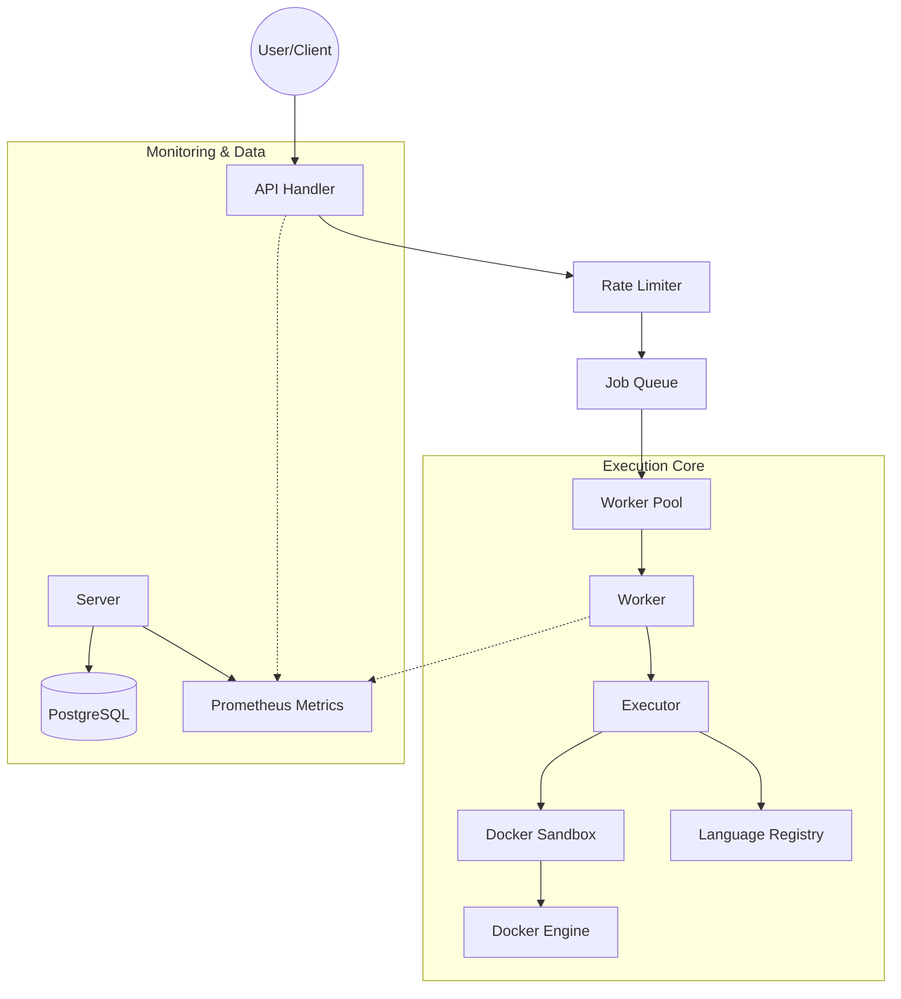

# Project Architecture

Executioner is a high-performance, secure code execution engine built in Go, designed to run user-submitted code in isolated containers. It is inspired by platforms like Judge0 and is built for scalability and security.

## System Overview

The system follows a modular architecture where each component has a clear responsibility.

## Component Breakdowns

### 1. API Layers (`internal/api`)

- **HTTP Handlers**: Handles incoming `/execute` requests.
- **Rate Limiter (`internal/limiter`)**: Enforces global, per-IP, and concurrency limits to prevent abuse and system overload.

### 2. Job Orchestration (`internal/queue`, `internal/worker`)

- **Job Queue**: An in-memory buffered channel that decoupled request handling from execution.
- **Worker Pool**: A configurable number of goroutines that pull jobs from the queue and process them concurrently.

### 3. Execution Engine (`internal/executor`)

- The "brain" of the system. It coordinates the execution flow:
  1. Fetches language configuration from the Registry.
  2. Initializes the Sandbox workspace.
  3. Handles compilation (if required).
  4. Runs the code and captures results.

### 4. Sandbox Isolation (`internal/sandbox`)

- Uses **Docker** for robust isolation.
- **Security Hardening**:
  - **No Networking**: Containers are started with `NetworkDisabled: true`.
  - **Resource Limits**: Configurable CPU and Memory quotas.
  - **PID Limits**: Prevents fork bombs by limiting the number of processes inside the container.
  - **Dropped Capabilities**: All Linux capabilities are dropped (`CapDrop: ALL`).
  - **Non-Privileged**: Runs with `no-new-privileges`.
  - **Tmpfs Mounts**: Source code is executed in a memory-backed writable filesystem (`/home/sandbox`), while the root filesystem remains unpolluted.

### 5. Language Registry (`internal/languages`)

- Manages runtime configurations for different languages (C++, Python, Node.js, etc.).
- Defines Docker images, source filenames, compile commands, and run commands.

### 6. Observability (`internal/metrics`)

- Integrated **Prometheus** metrics for real-time monitoring:
  - Execution counts and status.
  - Latency (compilation vs. execution).
  - Queue depth and worker utilization.
  - Resource usage.

## Data Flow (Success Case)

1. Client sends POST request to `/execute`.
2. Rate Limiter validates the request.
3. Request is converted into a `Job` and pushed to the `Queue`.
4. An idle `Worker` picks up the `Job`.
5. `Worker` calls `Executor.Execute()`.
6. `Executor` prepares the container via `Sandbox`.
7. `Sandbox` writes the code (via `exec` to respect tmpfs) and starts execution.
8. Result (stdout, stderr, exit code, time) is returned to the `Worker`.
9. `Worker` sends the result back to the `API Handler` via a response channel.
10. `API Handler` returns JSON to the Client.
